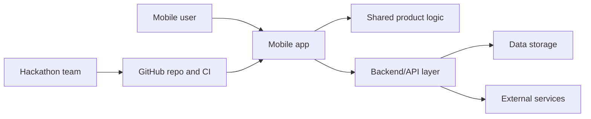

# 8x Mobile Hackathon

Production-ready starter repository for the 8x mobile hackathon.

This repo is set up to be easy for three audiences to understand:

- Judges: what we are building, why it matters, and how the system works.
- Collaborators: how to contribute safely without breaking the baseline.
- AI coding tools: where the architecture, standards, and workflows are documented.

## What This Repository Provides

- Clear architecture documentation for technical and non-technical readers.
- CI checks for repository structure and baseline quality.
- Security scanning through GitHub Actions, CodeQL, dependency review, and secret scanning.
- Dependabot configuration for dependency and Actions updates.

## Repository Map

```text
.
|-- .github/                 GitHub Actions, Dependabot, issue and PR templates
|-- docs/                    Architecture, case study, security, decisions
|-- scripts/                 Repository validation utilities
|-- AGENTS.md                Instructions for AI coding agents
|-- CONTRIBUTING.md          Collaboration workflow
|-- README.md                Project entry point
|-- SECURITY.md              Vulnerability reporting and security posture
```

## Architecture At A Glance



The first engineering milestone is to replace these placeholder component names with the chosen product architecture while keeping the same documentation pattern.

## Quick Start

```bash
npm ci
npm run validate
```

## Delivery Notes

Use [docs/CASE_STUDY.md](docs/CASE_STUDY.md) as the judge-facing story and [docs/ARCHITECTURE.md](docs/ARCHITECTURE.md) as the system walkthrough. Keep both updated whenever the implementation changes.

## Releases

Hackathon releases start as demo releases. Use [docs/RELEASE_POLICY.md](docs/RELEASE_POLICY.md) for the policy and [docs/DEPLOYMENT.md](docs/DEPLOYMENT.md) for the deployment record.

The first demo release should be tagged `demo-v0.1.0` through the GitHub Actions `Release` workflow.
