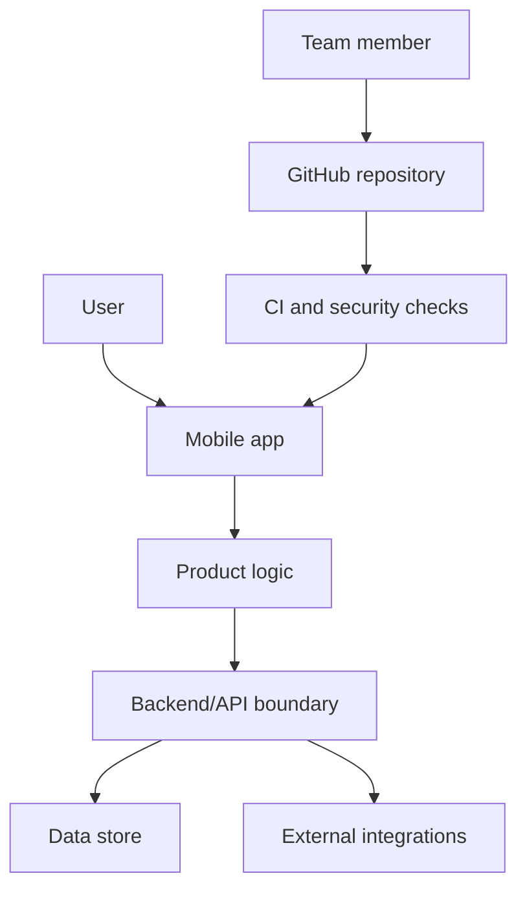
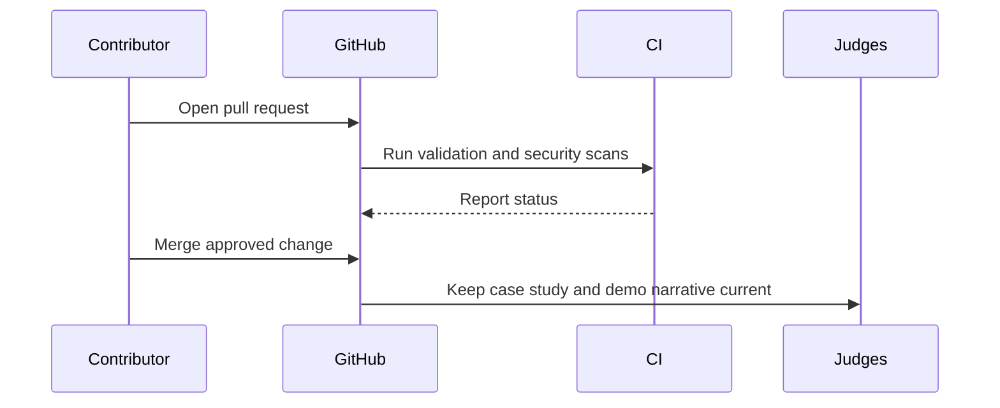

# Architecture

This document explains the system in a way that works for judges, designers, product collaborators, and engineers.

## Plain-English Summary

The product will be a mobile experience backed by a clear application layer and measurable delivery pipeline. The app should make the user journey simple, while the repository keeps the engineering process visible: every change is validated, scanned, and documented.

## System View

## Component Responsibilities

| Component | Purpose | Audience-Friendly Explanation |
| --- | --- | --- |
| Mobile app | User interface and device workflows | What people touch and experience. |
| Product logic | Rules, calculations, and state transitions | The product brain that keeps behavior consistent. |
| Backend/API boundary | Secure access to data and services | The controlled doorway between the app and trusted systems. |
| Data store | Persistent product data | Where the product remembers important information. |
| CI and security checks | Automated quality gates | A safety net that checks each change before it becomes part of the demo. |

## Delivery Flow

## Security Model

- Secrets are provided through environment variables and GitHub repository secrets.
- Pull requests run validation before merge.
- Dependency changes are reviewed automatically.
- Code scanning is enabled through CodeQL.
- Documentation must explain user data flows before sensitive features are added.

## Next Architecture Decision

The first feature PR should replace the generic component names with the chosen stack, such as React Native or Expo for mobile, a backend framework, storage, and deployment target.
