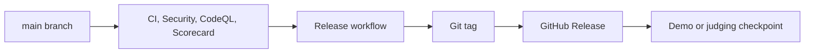

# Deployment

This repository currently treats GitHub Releases as the deployment record. That is appropriate for the first hackathon phase because the app stack and hosting target have not been selected yet.

## Current Deployment Flow

## Demo Deployment

Use demo releases for anything shown to judges or hackathon collaborators:

- Tag: `demo-v0.1.0`, `demo-v0.2.0`, and so on.
- GitHub Release: marked as prerelease.
- Notes: written for both technical and non-technical readers.

## Future Deployment Hook

When the team chooses the mobile stack, add one of these deployment paths:

- Expo/EAS build for React Native or Expo apps.
- TestFlight or Play Console internal testing for native mobile builds.
- Web preview hosting if the demo includes a web companion.
- API deployment if a backend is introduced.

The deployment job should run after validation and before the GitHub Release is published.
